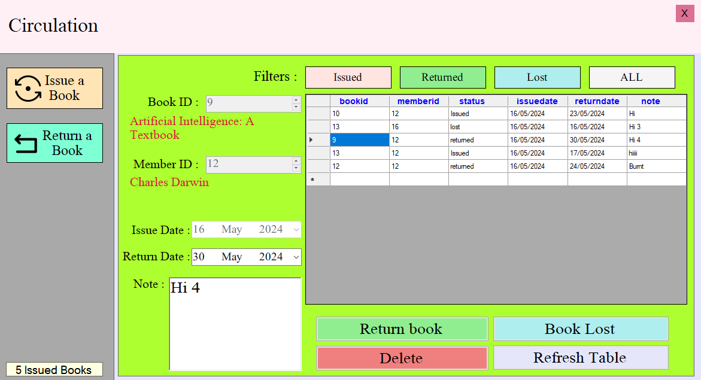

# Library Management System

A Library Management System for managing a database of books with its authors and genres, and allowing these books to be issued to members and manage returned and lost books.

## Contents

- [Features](#features)
- [Installation](#installation)
- [Functionality and Screenshots](#functionality-and-screenshots)
- [Credits](#credits)

## Features

- Login screen for users separated by two users types, admins and users. There is also one owner account.
- Latest books added to the system.
- Total books, authors, and genres in each respective database.
- Manage books section for adding, editing, removing books with an option to see the entire book database.
- Manage authors section for adding, editing and removing authors. Option to see all books by an author also available.
- Manage genres for all books with adding, editing and deleting genres.
- Manage members that are part of the library.
- Issue books to members and have them return the book by a set date, with the option to set books as lost.
- Manage users that can use this library system. Only the owner user type can access this.

## Installation

### Prequisites

- [XAMPP Web Server](https://www.apachefriends.org/) (Start Apache and MySQL, port 3306 for MySQL)
- [MySQL Connector for .NET](https://dev.mysql.com/downloads/connector/net/)  (Project uses MySQL Connector NET 8.0.33, latest ver is 8.4.0)
- Clone the repo with `git clone https://github.com/K-Kocak/LibraryManagementSystemProject.git`

## Functionality and Screenshots

*Login screen*

User login screen. By default (for development purposes) the fields entered in are for the owner account.
- Checks username and password entered and compares to user database. If match is found, user logs in.

*Dashboard*

Main hub for this project.
- User has several options to pick on the left hand panel to access Books, Authors, Genres, Members, Books Issued (Circulation) and Users.
- Only the owner account can access Users.
- Admins can access everything except Users.
- Regular users can only access books, authors and genres.
- Information about the four latest books is displayed (the front cover and the price of the book).
- Total number of books, authors and members in their respective databases is shown.

*Manage Books - Add Book*

User enters information about a book they want added to the database. Code sorts out ID for the book automatically.
- The information a user can enter is seen in the picture, but includes ISBN, title of the book, the author of the book, the genre, how many books are being added (quantity), the price of the book, who published the book, when the books were received, information about the book and finally, the front cover of the book.
- A button to add the book to the database and one for clearing all the input fields to the default state (empty).
- A button to show the author list (next screenshot).
- A field in the bottom left displaying the total number of books currently in the book database.
- *Fields marked with a * are required to add a book.*

*Manage Books - Add Book - Author List*

Shows all authors in the database.
- User selects relevant author and clicks the button at the bottom.

*Manage Books - Edit Book*

Similar functionality to add book, with the addition of two "Search by" buttons and the edit button.
- Enter the book id you want to edit, then click "Search by ID" and the rest of the fields will auto-fill.
- This can also be done with the ISBN of the book, and the fields will auto fill.
- Edit book button will modify the book with the relevant ID with the fields entered.
- *Fields marked with a * are required to edit the book.*

*Manage Books - Delete Book*

Enter the ID of the book you want deleted, and it'll go poof in the database.

*Manage Books - Book List*

Displays all the books currently in the database.
- Edit selected book will take you to the "Edit a book" screen with input fields filled in automatically.
- Remove selected book is another way to delete books from the database.
- In both cases, the operation is done on whatever row is currently selected.

*Manage Books- Export Book List to File*

Upon clicking the export book list button, the ID, ISBN and the name of the book will be exported to a .txt file.

*Manage Authors*

Displays all Authors in the table on the right with input fields for adding/editing an author.
- When the Add Author button is pressed, it'll use the text in the input fields to create a field in the author database. ID field should be left blank as the table will auto-create the id value.
- Pressing Edit Author requires the ID field to be field in, this is the ID of the author that will be edited, and relevant field values will change in accordance to the input fields entered.
- Remove Author will delete the selected author in the data on the far right from the authors database.
- Export author data to a .txt file, the structure is id | firstname | surname.
- Show Author books displays a list of all unique books the selected author has in the books database (See in the next screen).
- A field displaying the total number of unique authors currently in the author database.

*Manage Authors - Author Books*

Shows all books in the book database that belong to the selected author.

*Manage Book Genres*

Displays all the genres currently in the database.
- Can add, edit or delete genres from the genre database.
- ID is automatically created if adding a new genre, but is required for editing or deletion.

*Manage Members*

Displays all members of the library in a table with add, edit and remove buttons to edit the table.
- Fill in the fields and choose an image to represent the member's picture, then click add to use this information to create a field in the database (create member).
- Selecting a row in the table will automatically fill in all the input fields and is used in conjuction with the edit or delete buttons.
- Clear Fields button resets the states of the input fields to default.
- Refresh Table refreshes the table display to display any modifications done to the table.
- A live count of the total number of members in the member table is in the bottom left.

*Circulation - Issue Book*

Issue book screen for issuing books to members with a set return date.
- A book ID is entered and upon clicking "Search Book", the text below will update to display the name of the book with this ID. If no book with this ID exists, the user will be informed.
- Clicking the title of this book will open a new screen detailing the properties of the book.
- Member ID and its relevant text field underneath follow the same logic: enter a member ID and search for the member, then the member's name will display below the field.
- Clicking the name of this member will bring up a member screen displaying information about this member.
- A check is made to see if there's any of the selected book ID available to issue out, and is displayed with a Yes/No.
- The issue and return date are by default set to the current day, however return date must be at a later point than issue date.
- Clicking issue book will grab the current input in the input fields and add a new field to the issued books database.
- A count of the current number of issued books is kept in the bottom left.

*Circulation - Book Information*

Displays all the information about a selected book. Literally everything, including the current quantity of books remaining that can be issued.
- Cover of the book is displayed, and all the extra text associated with the book when it was added/edited into the database is at the bottom.

*Circulation - Member Information*

Similar to book information, displays information about the member, with their picture displayed on the left.

*Circulation - Return a Book*

Intended to be used when some sort of update needs to occur with a book that's been issued.
- The first update being if an issued book has been returned. The book in question is selected from the issued books database, then the return book button is pressed which sets its status to "returned".
- If the book is somehow lost or never returned, "Book Lost" is pressed instead, marking it's status as "lost" -- it is gone forever.
- The option to delete any clicked data is available for whatever reason.
- A refresh table button to refresh the contents of the table.
- The filters at the top will display only the entries with the status "Issued", "returned", "lost" or ALL books in the issued books database respectively.
- The return date can be edited if a book was late on return, with a secton to edit the "note" for the relevant field if necessary.

*Manage Users*

Manage the users that will use this application. Only an "owner" user type can access this screen.
- New users can be added by filling in the input fields.
- If the user is made an admin, they will have access to the circulation of books and members.
- When creating or editing a user, password and re-type password must be equal ofcourse.
- Clicking a user in the data display will fill in the input fields automatically, intended to be used when editing or deleting users from the users database.
- The owner user type will not appear in this table to avoid accidental deletion. Any modifications on an owner user type must be done directly done to the table outside this application.

## Credits

### Tools

- C#
- MySql
- Visual Studio

[Back to Top](#contents)
